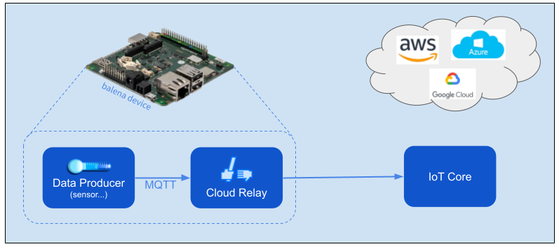

# Cloud Relay Block

*Easily send data to an IoT Cloud provider*



Cloud Relay accepts application data via MQTT and relays it to a cloud provider's IoT Core facility. You only need to provide the data, and Cloud Relay takes care of messaging with the cloud provider. Cloud Relay works with AWS IoT Core and Google Cloud (GCP) IoT Core.

## Getting Started

Use the docker-compose [example script](docker-compose.yml), which provides WiFi metrics data for Cloud Relay. We assume you also have some capability to provision devices securely to the provider's device registry. See the *Provisioning* section below.

First create a multi-container fleet in balenaCloud and provision a device with balenaOS. See the [online docs](https://www.balena.io/docs/learn/getting-started/raspberrypi3/nodejs/) for details. Next define the fleet variables from the cloud provider's setup, as described in the *Configuration* section below. Finally push the docker-compose script to the balena builders, substituting your fleet's name for `<myFleet>` in the commands below.

```
    git clone https://github.com/balena-io-examples/cloud-relay.git
    balena push <myFleet>
```

After any automated cloud provisioning, you should see data flowing through the cloud relay to the provider's MQTT broker, like the log output below.

```
sensor  publishing sample: {} {'short_uuid': 'ab24d4b', 'quality_value': '70', 'quality_max': '70', 'signal_level': '-39'}
sensor  publishing sample: {} {'short_uuid': 'ab24d4b', 'quality_value': '70', 'quality_max': '70', 'signal_level': '-39'}
```

**GCP Note** Cloud Relay publishes only to the telemetry (events) topic. It does not publish to the state topic or subscribe to the configuration or commands topics.

### Provisioning

Cloud relay depends on secure provisioning of a balena device to the provider's registry before publishing data. We have developed projects that automate this provisioning, including use of the provider's "cloud function" capability to trigger the provisioning code via HTTP. See the linked projects in the table below and the `PROVISION_URL` environment variable in the *Configuration* section below.

| Provider / Cloud Function | GitHub project |
|----------|-------------------|
| AWS Lambda | [balena-aws-lambda](https://github.com/balena-io-examples/balena-aws-lambda) |
| GCP Cloud Functions | [gcp-iot-cloud](https://github.com/balena-io-examples/gcp-iot-cloud) |

The provisioning tool also generates environment variables required by the device to communicate with the provider, also listed in the *Configuration* section.

## Configuration

Environment variables, probably common to all devices so may be defined as balena **Fleet** variables.

|  Name | Value | Notes |
|-------|-------|-------|
|  PROVISION_URL   | AWS Lambda like<br>`https://xxxxxxxx.execute-api.us-east-1.amazonaws.com/resinLambda-development`<br><br>GCP Cloud Functions like<br>`https://<region>-<projectID>.cloudfunctions.net/provision` | URL to contact the provisioning cloud function. See the README for the respective cloud provisioning projects above for specifics.|
| PRODUCER_TOPIC| default `sensors` | Message topic from data producer |
| CLOUD_DATA_TOPIC| AWS default `sensors`<br><br>GCP default `events` | Message topic for data to cloud. For GCP, `events` is the default *telemetry* topic. As the docs [describe](https://cloud.google.com/iot/docs/how-tos/mqtt-bridge#publishing_telemetry_events_to_additional_cloud_pubsub_topics), you also may publish to a subfolder like `events/alerts`. |

**AWS** specific variables

|  Name | Value | Notes |
|-------|-------|-------|
| AWS_DATA_ENDPOINT| like `xxxxxxxx-ats.iot.us-east-1.amazonaws.com                               ` | Host name to receive data. See *Settings* in the AWS IoT console. |

The provisioning tool generates AWS_CERT, AWS_PRIVATE_KEY, and AWS_ROOT_CA.

**GCP** specific variables

|  Name | Value | Notes |
|-------|-------|-------|
| GCP_PROJECT_ID | like `my-project-000000` | as you defined it in IoT Core |
| GCP_ROOT_CAS | | Concatenation of root CA certificates, as described below |
| GCP_TOKEN_LIFETIME | default `1440`<br><br>= 24 hours | Messaging JWT token lifetime in minutes, used to set expiration. Defaults to maximum allowed. Token is renewed 15 minutes before expiration. |

The provisioning tool generates GCP_CLIENT_PATH, GCP_DATA_TOPIC_ROOT, and GCP_PRIVATE_KEY.


Cloud Relay publishes to the GCP [long term domain](https://cloud.google.com/iot/docs/how-tos/mqtt-bridge#using_a_long-term_mqtt_domain), `mqtt.2030.ltsapis.goog`. This domain uses two root CA certificates, which are linked from that page. Use the script below to create the content for the `GCP_ROOT_CAS` variable from the certificates.

```
# Convert root cert format from DER to PEM
openssl x509 -inform der -in gtsltsr.crt -out gtsltsr.pem
openssl x509 -inform der -in GSR4.crt -out GSR4.pem

# Concatenate and base64 encode for environment variable
cat gtsltsr.pem GSR4.pem |base64 -w 0
```
