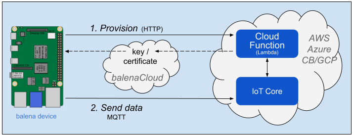

# Cloud Relay Block

*Easily send data to an IoT Cloud provider*


Cloud Relay accepts application data via MQTT and relays it to a cloud provider's IoT Core facility. You only need to provide the data, and Cloud Relay takes care of messaging with the cloud provider. Cloud Relay works with AWS, Azure, and Google Cloud (GCP).

## Getting Started

You first must set up the cloud provider's IoT service. Balena also provides cloud functions for AWS, Azure and GCP that expose an HTTP endpoint to initially provision each device. See the _Cloud Provisioning_ section below.

### Device
On the balena device, we will use a docker-compose [example script](doc/wifi-example/docker-compose.yml) that includes containers for generation of WiFi metrics data, an MQTT broker, and the Cloud Relay block itself. First create a multi-container fleet in balenaCloud and provision a device with balenaOS. See the [online docs](https://www.balena.io/docs/learn/getting-started/raspberrypi3/nodejs/) for details.

Next define fleet variables as described in the *Configuration* section below. Finally push the docker-compose script to the balena builders, substituting your fleet's name for `<myFleet>` in the commands below.

```
    git clone https://github.com/balena-io-examples/cloud-relay.git
    cd cloud-relay/doc/wifi-example
    balena push <myFleet>
```

Cloud Relay first will attempt to provision the device if required, using `PROVISION_URL`. Once that completes, you should see data flowing through the cloud relay to the provider's MQTT broker, like the log output below.

```
sensor  publishing sample: {} {'short_uuid': 'ab24d4b', 'quality_value': '70', 'quality_max': 70, 'signal_level': -39.0}
sensor  publishing sample: {} {'short_uuid': 'ab24d4b', 'quality_value': '70', 'quality_max': 70, 'signal_level': -39.0}
```

**GCP Note** Cloud Relay publishes only to the telemetry (events) topic. It does not publish to the state topic or subscribe to the configuration or commands topics.

### Cloud Provisioning

Cloud Relay triggers secure provisioning of a balena device to the provider's registry before publishing data. This provisioning generates public key credentials as environment variables, which are stored on balenaCloud and passed on to the device. Cloud Relay then uses the credentials to communicate with the provider's IoT Core.



We have developed projects that automate this provisioning, including use of the provider's "cloud function" capability to trigger the provisioning code via HTTP request. See the linked projects in the table below and the environment variables in the *Configuration* section below.

| Provider / Cloud Function | GitHub project |
|----------|-------------------|
| AWS Lambda | [aws-iot-provision](https://github.com/balena-io-examples/aws-iot-provision) |
| Azure Functions | [azure-iot-provision](https://github.com/balena-io-examples/azure-iot-provision) |
| GCP Cloud Functions | [gcp-iot-provision](https://github.com/balena-io-examples/gcp-iot-provision) |

## Configuration

Environment variables, probably common to all devices so may be defined as balena **Fleet** variables. This section is organized by cloud provider. In all cases Cloud Relay must know the message topic used by the data producer.

|  Name | Value | Notes |
|-------|-------|-------|
| PRODUCER_TOPIC| default `sensors` | Message topic from data producer. `sensors` is used by the [Sensor](https://github.com/balenablocks/sensor) block. |


### AWS

|  Name | Value | Notes |
|-------|-------|-------|
|  PROVISION_URL   | like<br>`https://xxxxxxxx.execute-api.<region>.amazonaws.com/default/provision` | URL to trigger the provisioning cloud function. See *Functions -> provision -> Configuration -> Triggers* in the AWS Lambda console. |
| AWS_DATA_ENDPOINT| like<br>`xxxxxxxx-ats.iot.<region>.amazonaws.com                               ` | Host name to receive data. See *Settings* in the AWS IoT console. |
| CLOUD_CONSUMER_TOPIC| default `sensors` | Topic for message sent to AWS. |

AWS_CERT and AWS_PRIVATE_KEY variables for each device are [generated](https://github.com/balena-io-examples/aws-iot-provision#device-environment-variables) by the provisioning tool.

### Azure

|  Name | Value | Notes |
|-------|-------|-------|
|  PROVISION_URL   | like<br>`https://<region>-<projectID>.cloudfunctions.net/provision` | URL to trigger the provisioning cloud function.|
| AZURE_HUB_HOST | like<br>`<iot-hub-name>.azure-devices.net` | Host name to receive data. See *Overview* for the IoT Hub in the Azure portal. |
| CLOUD_CONSUMER_TOPIC| default `sensors`| Cloud Relay creates a `topic` key with this value in the `properties` map included in the message to Azure. |

AZURE_CERT and AZURE_PRIVATE_KEY variables for each device are [generated](https://github.com/balena-io-examples/azure-iot-provision#device-environment-variables) by the provisioning tool.

### GCP

|  Name | Value | Notes |
|-------|-------|-------|
|  PROVISION_URL   | like<br>`https://<region>-<projectID>.cloudfunctions.net/provision` | URL to trigger the provisioning cloud function. |
| CLOUD_CONSUMER_TOPIC| default `events` | Topic for message sent to GCP, which expects `events` as the default *telemetry* topic. As the docs [describe](https://cloud.google.com/iot/docs/how-tos/mqtt-bridge#publishing_telemetry_events_to_additional_cloud_pubsub_topics), you also may publish to a subfolder like `events/alerts`. |

GCP_CLIENT_PATH, GCP_DATA_TOPIC_ROOT, GCP_PRIVATE_KEY, and GCP_PROJECT_ID variables for each device are [generated](https://github.com/balena-io-examples/gcp-iot-provision#device-environment-variables) by the provisioning tool..
